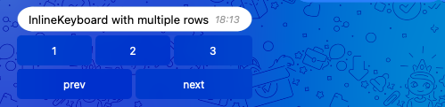
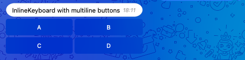
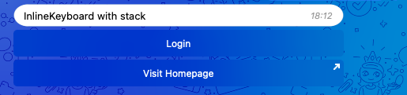

<div id="top"></div>

![Bot API][bot-api-shield]
![Tests][tests-shield]

<!-- TABLE OF CONTENTS -->
<details>
  <summary>Table of Contents</summary>
  <ol>
    <li><a href="#installation">Installation</a></li>
    <li>
        <a href="#usage">Usage</a>
        <ol>
            <li><a href="#defining-a-keyboard">Defining a Keyboard</a></li>
            <li><a href="#defining-buttons">Defining Buttons</a></li>
            <li>
                <a href="#bind-buttons-to-a-keyboard">Bind Buttons to a Keyboard</a>
                <ol>
                    <li><a href="#by-row">By Row</a></li>
                    <li><a href="#by-button">By Button</a></li>
                    <li><a href="#as-stack">As Stack</a></li>
                </ol>
            </li>
            <li><a href="#forcereply-and-replykeyboardremove">ForceReply and ReplyKeyboardRemove</a></li>
            <li><a href="#keyboardbuttonpolltype">KeyboardButtonPollType</a></li>
        </ol>
    </li>
  </ol>
</details>

## Installation

Install the package using composer:

```shell
composer require php-telegram-bot/fluent-keyboard 
```

<p align="right">(<a href="#top">back to top</a>)</p>

## Usage

If you need to create a keyboard you can use the classes provided by this package as a drop-in replacement.

This is best explained with an example:

```php
Request::sendMessage([
    'chat_id'      => 12345,
    'text'         => 'Keyboard Example',
    'reply_markup' => ReplyKeyboardMarkup::make()
        ->oneTimeKeyboard()
        ->button(KeyboardButton::make('Cancel'))
        ->button(KeyboardButton::make('OK')),
]);
```

A ReplyKeyboardMarkup is created by calling the static `make()` method on `ReplyKeyboardMarkup`. After that every field,
like `one_time_keyboard`, can be chained by calling it in camelCase. Buttons can be added by calling
the `button()` method. We have a detailed look on that later.

The classes and fields are named after the corresponding types and fields of
the [Telegram Bot API](https://core.telegram.org/bots/api).

<p align="right">(<a href="#top">back to top</a>)</p>

### Defining a Keyboard

You can create a keyboard by calling the static `make()` method on its class.

After that you can chain methods to set additional fields that are available in the Bot API. This is done by calling the
field name in camelCase. So instead of input_field_placeholder, you need to call `inputFieldPlaceholder()`.

```php
ReplyKeyboardMarkup::make()
    ->inputFieldPlaceholder('Placeholder');
```

<p align="right">(<a href="#top">back to top</a>)</p>

### Defining Buttons

The Buttons are created in the same way:

```php
KeyboardButton::make()
    ->text('Text of Button')
    ->requestContact();
```

As a shortcut, you can pass the mandatory `text` field as an argument of the static `make()` method like this:

```php
KeyboardButton::make('Text of Button')
    ->requestLocation();
```

This is done the same way for `InlineKeyboardButton`:

```php
InlineKeyboardButton::make('Login')
    ->loginUrl('https://example.com');
```

To find out which fields are available have a look at the [Bot API documentation](https://core.telegram.org/bots/api).

<p align="right">(<a href="#top">back to top</a>)</p>

### Bind Buttons to a Keyboard

The keyboard does not work without any buttons, so you need to pass the buttons to the keyboard. There are a few ways to
do this.

#### By Row

```php
ReplyKeyboardMarkup::make()
    ->row([
        KeyboardButton::make('Cancel'),
        KeyboardButton::make('OK')
    ]);
```

If you need more than one row, call `row()` multiple times:

```php
InlineKeyboardMarkup::make()
    ->row([
        InlineKeyboardButton::make('1')->callbackData('page-1'),
        InlineKeyboardButton::make('2')->callbackData('page-2'),
        InlineKeyboardButton::make('3')->callbackData('page-3')
    ])
    ->row([
        InlineKeyboardButton::make('prev')->callbackData('page-prev'),
        InlineKeyboardButton::make('next')->callbackData('page-next')
    ]);
```



#### By Button

```php
ReplyKeyboardMarkup::make()
    ->button(KeyboardButton::make('First Button'))
    ->button(KeyboardButton::make('Second Button'));
```

If you need more than one row, just call the row method without arguments, and continue calling `button()`:

```php
InlineKeyboardMarkup::make()
    ->button(InlineKeyboardButton::make('A')->callbackData('answer-a'))
    ->button(InlineKeyboardButton::make('B')->callbackData('answer-b'))
    ->row()
    ->button(InlineKeyboardButton::make('C')->callbackData('answer-c'))
    ->button(InlineKeyboardButton::make('D')->callbackData('answer-d'));
```


It's up to you if you define your buttons inline like in these examples or you'd like to generate a whole row before and
pass the variable to the `row()` method.

#### As Stack

If you want to add a bunch of buttons that have each a row for themselves you can use the `stack()` method.

```php
InlineKeyboardMarkup::make()
    ->stack([
        InlineKeyboardButton::make('Login')->loginUrl([
            'url' => 'https://example.com/login'
        ]),
        InlineKeyboardButton::make('Visit Homepage')->url('https://example.com')
    ]);
```



**You can mix and match the `row()`, `stack()` and `button()` methods as it fits your needs.**

<p align="right">(<a href="#top">back to top</a>)</p>

### ForceReply and ReplyKeyboardRemove

ForceReply and ReplyKeyboardRemove can be used the same way as a normal keyboard, but they do not receive any buttons:

```php
$this->replyToUser('Thank you', [
    'reply_markup' => ReplyKeyboardRemove::make()->selective(),
]);
```

```php
$data['reply_markup'] = ForceReply::make()->inputFieldPlaceholder('Please type something...');
```

<p align="right">(<a href="#top">back to top</a>)</p>

### KeyboardButtonPollType

The `request_poll` field is a little special. You can specify which poll type the user can create by passing
a `KeyboardButtonPollType` object.

```php
KeyboardButton::make()->requestPoll(KeyboardButtonPollType::regular())
```

The `KeyboardButtonPollType` class has static methods for each possible type. But if there are new types in the future
you don't have to wait until we release an update. You can either pass the array structure directly to
the `requestPoll()` method or you pass the array structure to the constructor of `KeyboardButtonPollType`.

```php
$pollButton = new KeyboardButtonPollType([
    'type' => 'quiz'
]);
```

[tests-shield]: https://img.shields.io/github/workflow/status/php-telegram-bot/fluent-keyboard/Tests?label=Tests&style=for-the-badge

[bot-api-shield]: https://img.shields.io/badge/Bot%20API-5.7%20(Jan%202022)-%232a9ed6?style=for-the-badge
